# SnowFlow AI

An AI-powered financial document processing platform that automatically extracts, analyzes, and structures financial data from various document formats, and ingests it into Snowflake. Built for hackathons and enterprise financial data processing workflows.

## 🧠 SnowFlow AI Dashboard


[](https://www.youtube.com/watch?v=rbdXRPEVgTU)

## 🚀 Features

- **Document Processing**: Extract text and data from PDFs, images, and financial statements
- **AI-Powered Analysis**: Uses Google Gemini AI and LandingAI ADE for intelligent data extraction
- **Automated Schema Design**: Creates optimized database schemas based on extracted data
- **Snowflake Integration**: Seamless deployment to Snowflake data warehouse
- **LangGraph Orchestration**: Advanced workflow management with conditional processing
- **RESTful API**: FastAPI backend with comprehensive endpoints
- **Modern UI**: React frontend with Tailwind CSS for intuitive document management

## 🏗️ Architecture

### Backend (FastAPI + LangGraph)
- **Document Extractor**: Converts PDFs/images to structured markdown using OCR and AI
- **Financial Analyzer**: Identifies document types, relationships, and data quality
- **Schema Designer**: Generates optimized database schemas for financial data
- **Snowflake Deployer**: Handles data loading and warehouse management
- **Orchestrator**: LangGraph-based workflow coordination

```mermaid
graph TB
    %% External Users and Data Sources
    subgraph "Users & Data Sources"
        U[👥 Users<br/>Upload Documents]
        DOCS[(📄 Financial Documents<br/>PDFs, Images, Statements)]
    end

    %% Frontend Layer
    subgraph "Frontend Layer"
        FE[⚛️ React Frontend<br/>Vite + Tailwind CSS]
        UI[📱 Document Upload<br/>Progress Tracking<br/>Data Visualization]
    end

    %% API Gateway Layer
    subgraph "API Gateway"
        API[🚀 FastAPI Server<br/>REST API<br/>CORS Enabled]
    end

    %% Core Processing Pipeline (LangGraph Orchestrator)
    subgraph "AI Processing Pipeline"
        ORCH[🎯 LangGraph Orchestrator<br/>Workflow Coordination]
        
        subgraph "Agent Nodes"
            EXTRACT[📝 Document Extractor<br/>OCR + Text Processing]
            ANALYZE[🔍 Financial Analyzer<br/>Document Classification<br/>Data Quality Assessment]
            SCHEMA[🏗️ Schema Designer<br/>Database Schema Generation<br/>DDL Creation]
            DEPLOY[☁️ Snowflake Deployer<br/>Data Loading<br/>Warehouse Management]
        end
    end

    %% AI Services Layer
    subgraph "AI & ML Services"
        GEMINI[🤖 Google Gemini AI<br/>Document Understanding<br/>Content Analysis]
        ADE[🎯 LandingAI ADE<br/>Structured Data Extraction<br/>Financial Metric Extraction]
    end

    %% Data Storage Layer
    subgraph "Data Storage"
        LOCAL[(💾 Local File System<br/>Uploaded Documents<br/>Markdown Files)]
        SF[❄️ Snowflake Data Warehouse<br/>Structured Financial Data<br/>Analytics Tables]
    end

    %% Configuration & Monitoring
    subgraph "Configuration & Monitoring"
        CONFIG[⚙️ Environment Config<br/>.env Files<br/>API Keys]
        LOGS[📊 Logging & Monitoring<br/>Processing Status<br/>Error Tracking]
    end

    %% Data Flow Connections
    U --> FE
    FE --> API
    API --> ORCH
    
    DOCS --> API
    DOCS --> LOCAL
    
    ORCH --> EXTRACT
    ORCH --> ANALYZE
    ORCH --> SCHEMA
    ORCH --> DEPLOY
    
    EXTRACT --> GEMINI
    ANALYZE --> GEMINI
    SCHEMA --> GEMINI
    EXTRACT --> ADE
    ANALYZE --> ADE
    
    EXTRACT --> LOCAL
    SCHEMA --> SF
    DEPLOY --> SF
    
    CONFIG -.-> API
    CONFIG -.-> GEMINI
    CONFIG -.-> ADE
    CONFIG -.-> SF
    
    ORCH -.-> LOGS
    API -.-> LOGS

    
    class FE,UI frontend
    class API,ORCH,EXTRACT,ANALYZE,SCHEMA,DEPLOY backend
    class GEMINI,ADE ai
    class LOCAL,SF storage
    class CONFIG,LOGS config
```



### Frontend (React + Vite)
- Document upload interface
- Real-time processing status
- Data visualization and exploration
- API integration with FastAPI backend

## 🛠️ Tech Stack

### Backend
- **FastAPI**: High-performance async web framework
- **LangGraph**: AI workflow orchestration
- **Google Gemini AI**: Advanced document understanding
- **LandingAI ADE**: Specialized financial data extraction
- **Snowflake**: Cloud data warehouse
- **Python**: Core language with async support

### Frontend
- **React 19**: Modern UI framework
- **Vite**: Fast build tool and dev server
- **Tailwind CSS**: Utility-first CSS framework
- **Lucide React**: Beautiful icon library

## 📋 Prerequisites

- Python 3.12+
- Node.js 18+
- Snowflake account (optional, for deployment)
- Google Gemini API key
- LandingAI API key

## 🚀 Quick Start

### 1. Clone and Setup

```bash
git clone https://github.com/dharaneesh71/Financeflow_ai.git
cd Financeflow_ai
```

### 2. Backend Setup

```bash
cd backend
```

# Create virtual environment

```bash
python -m venv backend_env
source backend_env/bin/activate
```  

# On Windows:

```bash
backend_env\Scripts\activate
```

# Install dependencies

```bash
pip install -r requirements.txt
```

# Configure environment variables

```bash
cp .env.example .env
```

# Edit .env with your API keys and Snowflake credentials

**Required Environment Variables:**

```bash
GEMINI_API_KEY=your_gemini_api_key
LANDINGAI_API_KEY=your_landingai_api_key
SNOWFLAKE_ACCOUNT=your_account.snowflakecomputing.com
SNOWFLAKE_USER=your_username
SNOWFLAKE_PASSWORD=your_password
SNOWFLAKE_WAREHOUSE=COMPUTE_WH
SNOWFLAKE_DATABASE=FINANCIAL_DATA
SNOWFLAKE_SCHEMA=PUBLIC
```
Note: Place `.env` file in same folder as `config.py`

### 3. Frontend Setup

```bash
cd ../frontend
```

# Install dependencies

```bash
npm install
```

# Start development server

```bash
npm run dev
```

### 4. Run Backend

```bash
# From backend directory with virtual env activated
cd backend
uvicorn app.main:app --host 0.0.0.0 --port 8000 --reload
```

## 📖 API Documentation

Once the backend is running, visit:
- **API Docs**: http://localhost:8000/docs
- **Health Check**: http://localhost:8000/health

### Key Endpoints

- `POST /api/upload` - Upload financial documents
- `POST /api/process` - Process documents with AI pipeline
- `POST /api/extract-markdown` - Extract markdown from documents
- `POST /api/suggest-metrics` - Get AI-suggested metrics
- `POST /api/extract-metrics` - Extract specific metrics from documents

## 🔄 Processing Pipeline

1. **Document Upload**: Files are uploaded and stored locally
2. **Markdown Extraction**: PDFs/images converted to structured markdown
3. **Metric Suggestion**: AI analyzes content and suggests extractable metrics
4. **Metric Selection**: User reviews and selects desired metrics
5. **Data Extraction**: LandingAI ADE extracts structured data
6. **Schema Design**: Automated database schema generation
7. **Snowflake Deployment**: Data loaded into Snowflake warehouse

## 📁 Project Structure

```
Financeflow_ai/
├── backend/
│   ├── app/
│   │   ├── agents/           # AI agents (extractor, analyzer, etc.)
│   │   ├── api/              # FastAPI routes
│   │   ├── prompts/          # AI prompt templates
│   │   ├── config.py         # Application configuration
│   │   ├── main.py           # FastAPI application
│   │   └── models.py         # Pydantic models
│   ├── uploads/              # Uploaded documents
│   └── requirements.txt
├── frontend/
│   ├── src/
│   │   ├── App.jsx           # Main React application
│   │   └── ...
│   ├── package.json
│   └── vite.config.js
└── README.md
```


## 🤝 Contributing

1. Fork the repository
2. Create a feature branch: `git checkout -b feature/new-feature`
3. Commit changes: `git commit -am 'Add new feature'`
4. Push to branch: `git push origin feature/new-feature`
5. Submit a pull request

## 📄 License

This project is licensed under the MIT License - see the [LICENSE](LICENSE) file for details.

## 🙏 Acknowledgments

- Built for AI Finance Hackathon
- Powered by Google Gemini AI and LandingAI
- Snowflake for data warehousing
- LangGraph for workflow orchestration

## 📞 Support

For questions or issues:
- Create an issue on GitHub
- Check the API documentation at `/docs`
- Review the processing logs for debugging

---

**Happy coding! 🎉**
